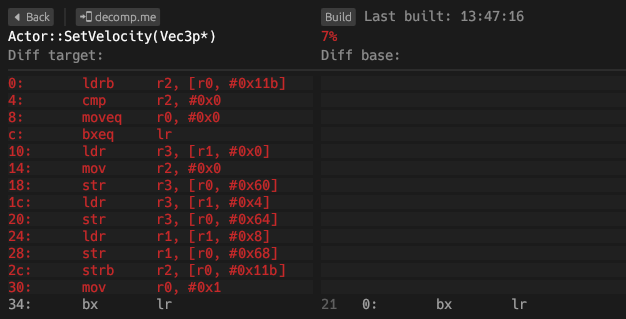
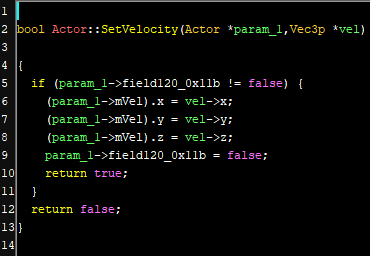
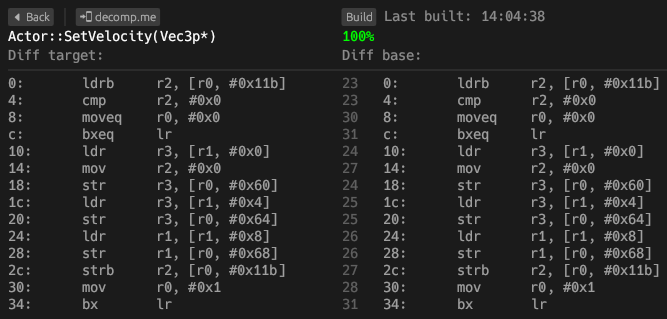

# Decompiling
This document describes how you can start decompiling code and contribute to the project. Feel free to ask for help if you get
stuck or need assistance.
- [Pick a source file](#pick-a-source-file)
- [Decompiling a source file](#decompiling-a-source-file)
- [Decompiling a function](#decompiling-a-function)
- [Decompiling `.init` functions](#decompiling-init-functions)
- [The Ghidra project](#the-ghidra-project)

## Pick a source file
See the `decomp` tag in the [issue tracker](https://github.com/AetiasHax/ph/issues?q=is%3Aopen+is%3Aissue+label%3Adecomp) for
a list of delinked source files that are ready to be decompiled. This list grows as more source files are delinked from the
rest of the base ROM.

You can claim a source file by leaving a comment on its issue, so that GitHub allows us to assign you to it. This indicates
that you are currently decompiling that source file.

If you want to unclaim the file, leave another comment so we can be certain that the source file is available to be claimed
again. Remember to make a pull request of any progress you made on the source file, whether it is just header files or
partially decompiled code.

## Decompiling a source file
We use the object diffing tool [`objdiff`](https://github.com/encounter/objdiff) to track differences between our decompiled C++ code and the base ROM's code.
1. [Download the latest release.](https://github.com/encounter/objdiff/releases/latest)
1. Run `configure.py <eur|usa>` and `ninja` to generate `objdiff.json` in the repository root.
1. In `objdiff`, set the project directory to the repository root.
1. Select your source file in the left sidebar:  

5. See the list of functions and data to decompile:  


> [!NOTE]
> If a source file is missing in `objdiff`, or `objdiff` fails to build a file, first rerun `objdiff.py` to update
> `objdiff.json`. If the problem persists, feel free to ask for help.

## Decompiling a function
Once you've opened a source file in `objdiff`, you can choose to decompile the functions in any order. We recommend starting
with a small function if you're unfamiliar with decompilation. Here's an example:



As a starting point, we look at the decompiler output in Ghidra. You can request access to our shared Ghidra project [in this section](#the-ghidra-project).



Looking at this output, we might try writing something like this:
```cpp
ARM bool Actor::SetVelocity(Vec3p *vel) {
    if (mUnk_11b) {
        mVel = *vel;
        mUnk_11b = false;
        return true;
    }
    return false;
}
```

Now we can go back to `objdiff` and look at the result:



Success! Note that this was a simple example and that you'll sometimes get stuck on a function. In that case, try the
following:
- Decompile a different function and come back later.
- Export to [decomp.me](https://decomp.me/):
    1. Press the `decomp.me` button in `objdiff`.
    1. Once you're sent to `decomp.me`, go to "Options" and change the preset to "Phantom Hourglass".
    1. Paste your code into the "Source code" tab.
    1. Share the link with us!

## Decompiling `.init` functions
> [!NOTE]
> This section will be updated as we learn more about global objects. Feel free to contribute or provide us with more
> information!

Functions in the `.init` section are static initializers. Their purpose is to call C++ constructors on global objects, and to
register destructors so the global objects can be destroyed when their overlay unloads.

Static initializers are generated implicitly and do not require us to write any code ourselves. So, to generate one, you must
define a global variable by using a constructor.

If the static initializer calls `__register_global_object`, that means the global object has a destructor. This means you'll
have to declare a destructor if it doesn't exist already.

Another consequence of having a destructor is that a `DestructorChain` object will be added to the `.bss` section. This struct
is 12 (`0xc`) bytes long and is also implicit, so we don't need to define it ourselves.

> [!IMPORTANT]
> An important thing to keep in mind is that a static initializer can construct multiple global objects.

## Decompiling data
> [!NOTE]
> Under construction! It's not fully clear how data is decompiled, as the compiler is strict on how it orders global variables.
> Feel free to contribute to this section or provide us with more information!

Other than `.text` and `.init` which contain code, there are the following sections for data:
- `.rodata`: Global or static constants
- `.data`: Global or static variables
- `.bss`/`.sbss`: Global or static uninitialized variables

You can see examples of these data sections in the [compilation section in `build_system.md`](/docs/build_system.md#compiling-code).

## The Ghidra project
We use a shared Ghidra project to analyze the game and decompile functions. To gain access to the project, install
[Ghidra version 10.2.3](https://github.com/NationalSecurityAgency/ghidra/releases/tag/Ghidra_10.2.3_build) and request access
from @aetias on Discord.
